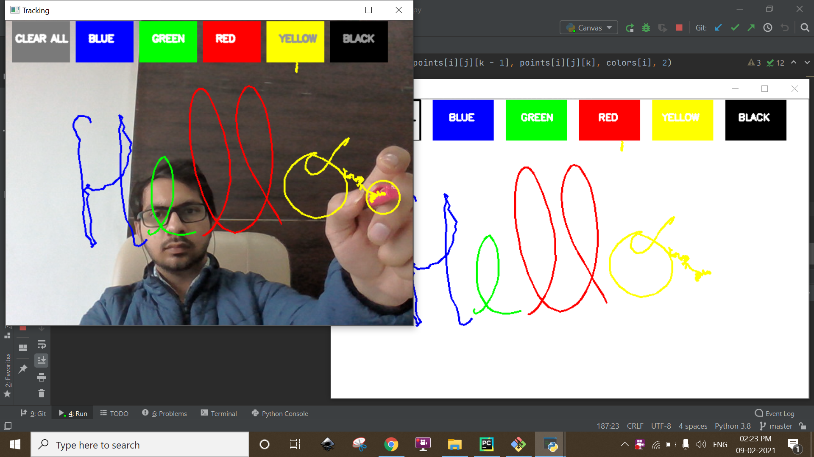

# Air-Canvas-project

Hello Guys, this is the Air Canvas project which allows you to draw in air using your finger. It uses OpenCv for color recognition using your camera.

We will be using the computer vision techniques of OpenCV to build this project. I preferred python programming language due to its various libraries and easy to use syntax but after understanding the basics this project can be implemented in any OpenCV supported language.

### Requirements

* [Python3](https://www.python.org/) - Programming Language used
* [Numpy](https://numpy.org/) - Used for Matrices
* [OpenCV](https://opencv.org/) - Used for Computer Vision

###ScreenShots

